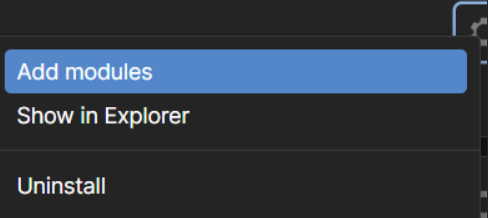
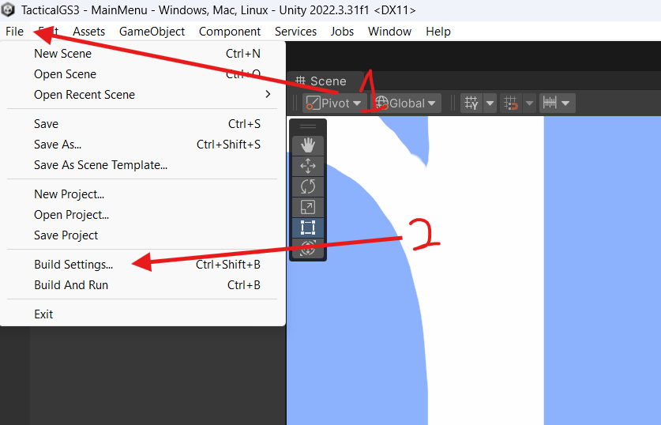
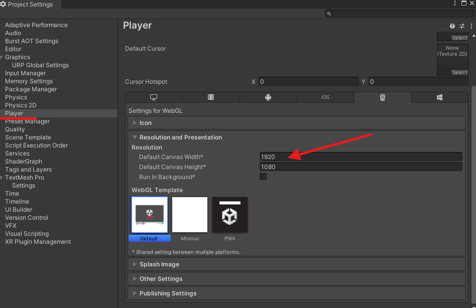

# Unity Web Build Tutorial

## By: Cole Dorman

### Designed for Unity version 2022.3.31f1


# Table of Contents

1. [Summary](#summary)

2. [Is a web build the right option for you?](#is-a-web-build-the-right-option-for-you)  
   2.1. [Web Build vs. Normal Build: Use Case Comparison](#web-build-vs-normal-build-use-case-comparison)

3. [Building your game](#building-your-game)  
   3.1. [Outcome](#build-outcome)  
   3.2. [Step 1 – Environment Setup](#step-1---environment-setup)  
   3.3. [Step 2 – Changing Platforms](#step-2---changing-platforms)  
   3.4. [Step 3 – Building the game](#step-3---building-the-game)

4. [Embedding your game into a webpage](#embedding-your-game-into-a-webpage)  
   4.1. [Outcome](#embed-outcome)  
   4.2. [Step 1 – Moving the Build](#step-1---moving-the-build)  
   4.3. [Step 2 – Testing and Embedding](#step-2---testing-and-embedding)

5. [Useful Information and Code](#useful-information-and-code)  
   5.1. [No JS Fallback](#no-js-fallback)

6. [FAQ](#faq)  
   6.1. [Iframes not correctly sizing](#iframes-not-correctly-sizing)

7. [Additional Information](#additional-information)


## Summary

This repository provides a step-by-step guide to building, configuring, and deploying Unity projects as web builds.
This guide will assume you have basic unity knowledge and a game built and will include detailed instructions, with images to guide you through delivering Unity
games or applications to a web platform.

# Is a web build the right option for you?

## Web Build vs. Normal Build: Use Case Comparison

| Use Case / Scenario                             | Web Build (WebGL)                               | Normal Build (Standalone/Desktop)               |
|--------------------------------------------------|--------------------------------------------------|--------------------------------------------------|
| **Demos and Prototypes**                         | ✅ Ideal for quick sharing via a browser link    | ❌ Requires download and install                 |
| **Marketing and Portfolios**                     | ✅ Easily embeddable on personal or promo sites  | ❌ Less accessible for casual viewers            |
| **Education and Interactive Media**              | ✅ Browser-based, no install barrier             | ❌ Often blocked or discouraged in classrooms    |
| **Performance-Intensive Games**                  | ❌ Limited by browser performance constraints    | ✅ Full access to system resources               |
| **Complex Multiplayer Networking**               | ❌ Limited socket/API support in browsers        | ✅ Full networking stack available               |
| **Persistent File Access / Mods**                | ❌ Restricted local file access in browser       | ✅ Can read/write files and use local mods       |
| **Hardware-Specific Features (VR, GPU, etc.)**   | ❌ Limited or unsupported in WebGL               | ✅ Better support for VR, advanced GPU features  |
| **Cross-Platform Distribution (Win/Mac/Linux)**  | ✅ One build works across many platforms via the browser | ❌ Must create and distribute separate builds for each operating system |
| **Broad Accessibility (Mobile/Desktop)**         | ✅ Can be played instantly on mobile or desktop in a browser — no install required | ❌ Users must download and install the correct version for their specific platform |
| **Update / Patch Workflow**                      | ✅ Just upload new files to server               | ✅ Rebuild and upload to each platform  |
| **Unity Feature Support**                        | ⚠️ Not all Unity features are WebGL-compatible   | ✅ Full Unity feature support                    |

> **Legend:** ✅ Recommended & supported — ⚠️ Limited or partially supported — ❌ Not ideal / unsupported


# Building your game

## Build Outcome

By the end of this guide you will have a html build locally of your game in web assembly.

## Step 1 - Environment Setup

Firstly ensure the correct Unity modules are installed. You can install the needed packages from Unity
hub, as shown with the red arrow below. Just click on the settings icon.


Select add modules.



Scroll down until you find WebGL. In this image it is installed, but you will have a little
checkbox to the left as shown in the image below.

## Step 2 - Changing Platforms


Launch your project, once your project opens go to file and then build settings



Switch platforms with the highlighted option WebGL, then click the bottom right "switch
platform" button


## Step 3 - Building the game

Go to player settings.


Once in player settings go to the Player category then put in the canvas width and height you designed your viewport
around



Once this is set then we can go ahead and go back to the project settings window. But before we do anything else,
make SURE all the scenes that are part of your game are added to the list. As shown below you can use Add open
scenes, also ensure the checkboxes are checked before building.


Then click build and run. Shortly once it builds you will have a web build that will pop up once it compiles!


---

# Embedding your game into a webpage

## Embed Outcome

By the end of this section of the guide you will have a working embedded game on your webpage that can is handled in an Iframe.

# Step 1 - Moving the Build
Firstly navigate to the build folder from the prior steps, this is usually located in the following directory (Given everything is installed everything in their default paths)

```
C:\Users\<YourUsername>\Documents\Unity Projects\<YourProjectName>\Build\
```
This is what the build folder should look like


What are these?

- Build/ – Contains Unity WebGL build files, including .wasm, .js, and .data.
- TemplateData/ – Stores Unity WebGL template assets like styles and scripts.
- index.html – Main HTML file that loads the WebGL game in a browser as an index.html page.

> **Note:** I recommend renaming the file from `index.html` to another name, as you will probably already have an `index.html` on your website. (Shown below)


Lastly move all 3 files to your website's source code. 

> **Note:** For context, the game I am using in this demonstration is called *Miku's Mall Madness*.


# Step 2 - Testing and Embedding

Given the following folder structure:


It can either be directly linked to it as a page such as:
```html
<a href="./MikusMallMadness/MikusMallMadnessGameDesktop.html">Miku's Mall Madness Game (Desktop)</a>
```

Or embedded using an Iframe:

```html
<iframe
        id="gameIframe"
        src=""
        title="Miku's Mall Madness">
</iframe>
```

To test go ahead and open the file or run your development build of your site in the browser:


*Try to play it through, ensure UI properly scales and the build is not broken.*

# Useful Information and Code

## No JS Fallback

Heere is a handy fallback that will prevent the website from appearing broken without reason

```html
<!-- Fallback message if JavaScript is disabled -->
<noscript>
   <p style="text-align: center;">
       The game requires JavaScript to run. Please enable JavaScript in your browser to play the game.
   </p>
</noscript>
```

# Faq

> **Note:** I have found that a lot of issues exist when doing Iframe embeds so I had found some solutions to certain one, there are as follows:

## Iframes not correctly sizing:

My solution for this one was to copy and paste the game's index file to create 2 versions as follows:


In each you will want to check the following:

Make sure the canvas height is what was specified project settings of the unity build.


Then here you may want to customize the sizing of the canvas, this is done in the else statement


> **Note:** I found that **640px by 480px for desktop** and a measly **128px by 72px for mobile** was most reliable, this is given a 16 by 9 aspect ratio

The following script can then be implemented which will change what the website loads based on the device:

```html
<!-- this handles desktop vs mobile version-->
<script>
   const isMobile = /Mobi|Android|iPhone|iPad|iPod|BlackBerry|Windows Phone|webOS/i.test(navigator.userAgent);
   const iframe = document.getElementById('gameIframe');
   iframe.src = isMobile ? "MikusMallMadnessGameMobile.html" : "MikusMallMadnessGameDesktop.html";
</script>
        
```

# Additional Information

[How to optimize your game for web builds](https://unity.com/how-to/profile-optimize-web-build)

[Code obfuscation and security](https://discussions.unity.com/t/protection-security-webgl/782427)
