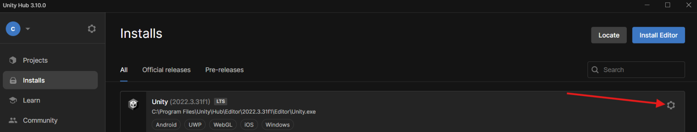
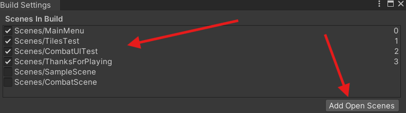

# Unity Web Build Tutorial

## By: Cole Dorman

### Designed for Unity version 2022.3.31f1

---

## Summary:

This repository provides a step-by-step guide to building, configuring, and deploying Unity projects as web builds.
I will assume you have first created a game, and I will primarily focus on the exporting and embedding of the build.
This guide will include detailed instructions, with images to guide you through delivering Unity
games or applications to a web platforms.

---

## Part 1 - Environment Setup

We will begin with ensuring the correct Unity modules are installed. You can install the needed packages from Unity
hub, as shown with the red arrow below. Just click on the settings icon.

Then go ahead and select add modules.

Then go ahead and scroll down until you find WebGL. I already have it installed here, but you will have a little
checkbox to the left as shown in the image below.

Then go ahead and launch your project, once your project opens go ahead and go to file and then build settings

Next we need to switch platforms with the highlighted option WebGL, and then we will click the bottom right "switch
platform" button

Once you have successfully switched platforms go ahead and go to player settings.

Once in player settings go to the Player category then put in the canvas width and height you designed your viewport
around

Once this is set then we can go ahead and go back to the project settings window. But before we do anything else,
make SURE all the scenes that are part of your game are added to the list. As shown below you can use Add open
scenes, also ensure the checkboxes are checked before building.

Then go ahead and click build and run. And Viola you will have a web build that will now pop up once it compiles!

